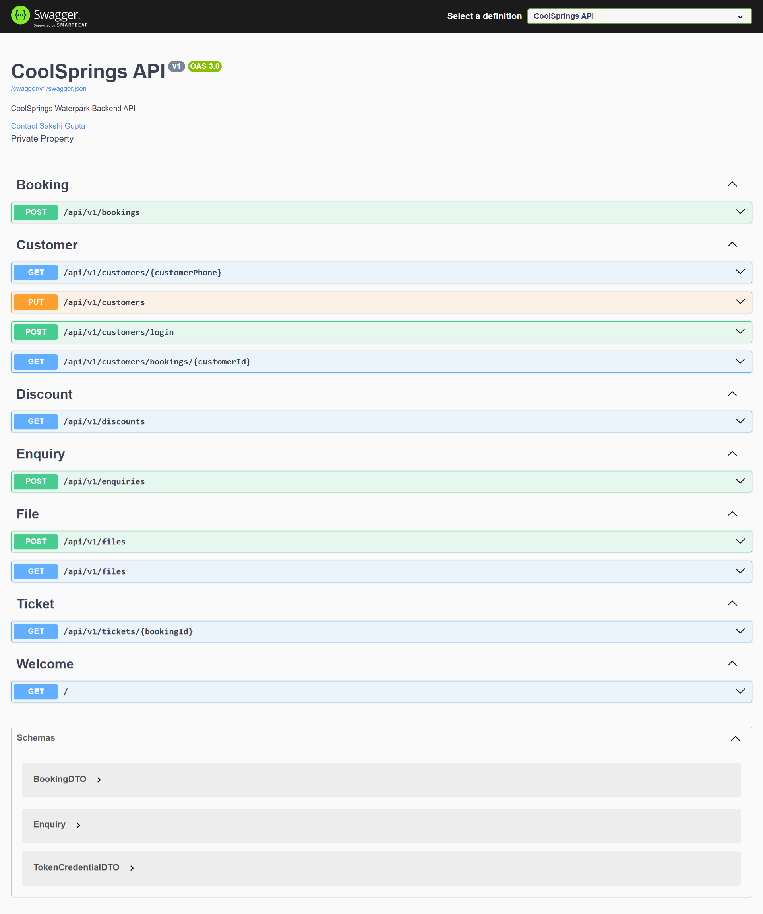

# CoolSprings API

Welcome to the CoolSprings Water Park backend API! This API powers the core functionalities of the CoolSprings water park booking system in Khargone, handling bookings, ticket generation, customer data, and QR code management.

## Features

✅ **Booking Management** – Create, update, and retrieve water park bookings.

✅ **Customer Booking History** – Fetch booking history for registered customers.

✅ **QR Code Generation** – Generate and validate QR codes for seamless park entry.

✅ **Secure RESTful API** – Designed with best practices for secure and scalable access.

## Tech Stack

**Backend :** .NET Core 8, C#

**Database :** Microsoft SQL Server

**ORM :** Dapper

**API Docs :** Swagger/OpenAPI

## Setup

1. **Clone the repository :**

```bash
git clone https://github.com/sakshikhargone/coolsprings-api.git
```

2.**Navigate to the project directory :**

```bash
cd coolsprings-api
```

3. **Configure your database connection :**

```bash
Update the connection string in appsettings.json to point to your SQL Server instance.
```

4. **Restore dependencies :**

```bash
dotnet restore
```

5. **Run the API server :**

```bash
 dotnet run
```

# App Screenshot



# Support

For any technical query, please write to sakshi.khargone@gmail.com
